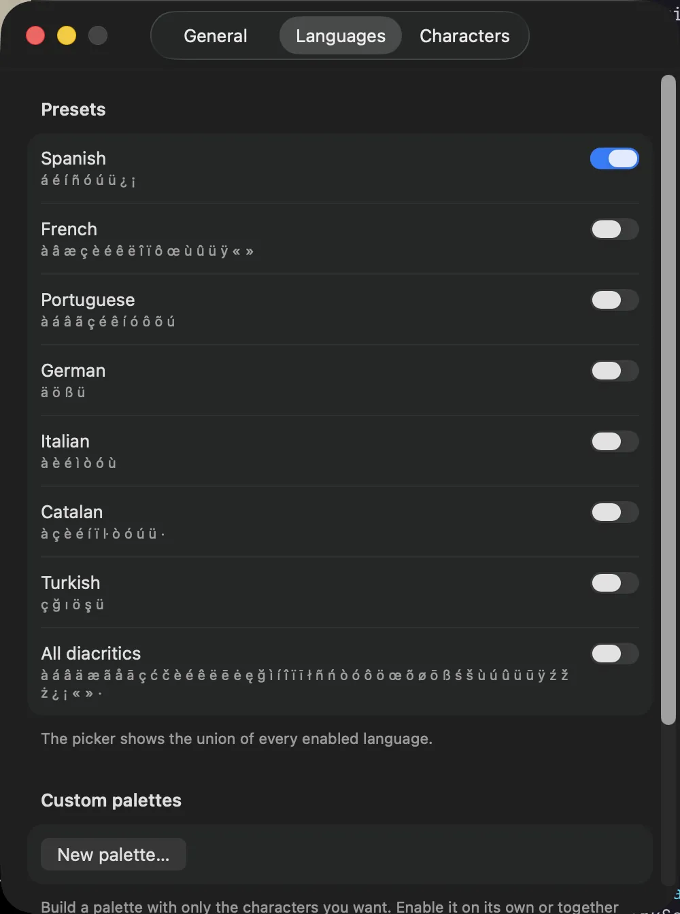

<div align="center">

# Accented

**The macOS accent picker you can configure.**

A tiny menu bar app that puts `á é í ñ ü ç ß` one keystroke away, limited to the
languages you actually write in.

[**accented.app**](https://accented.app) · [**Download for macOS**](https://accented.app/download) · [Report feedback](mailto:feedback@accented.app)


</div>

---

macOS already has an accent menu: hold a vowel and wait. In practice it is slow, it
disappears entirely when key repeat is on, and it lists every diacritic for every
language you ever enabled.

Accented replaces that flow with a global trigger and a picker that shows **only the
characters you use**. Press the hotkey, pick, keep typing.

## How it works

1. **Trigger.** Double-press `⌘`. A rebindable combo, `⌥Space` out of the box, works at the
   same time, and the double-press can be switched to `⌥` or turned off.
2. **The picker appears at your caret.** A small floating panel styled after the native
   accent popover, positioned at the text cursor, or near the mouse when the caret cannot
   be located.
3. **It reads context.** If the character just before the caret is a base letter (`a`, `e`,
   `n`, `c`, ...), the picker shows that letter's enabled variants and *replaces* it on
   selection: type `a`, hit the hotkey, pick `á`. Otherwise it shows your full enabled set
   in one row and *inserts* the selection.
4. **Select like the native menu.** Number keys `1`–`9`, arrows plus `Return`, or a click.
   `Esc` dismisses. Case follows the base character, so `A` gives `Á`.

Works in every app, with key repeat on, with no hold delay.

## Configure it



- **Language presets.** Spanish, French, Portuguese, German, Italian, Catalan, Turkish, plus
  an all-diacritics set. Enable one or several: the picker is the union. Spanish adds `¿ ¡`,
  French adds `œ æ`, German adds `ß`.
- **Per-character control.** Switch off individual characters inside a preset, or add your
  own characters and symbols.
- **Custom palettes.** Build a named set of exactly the characters you want, say `á í ñ`, and
  enable it like a language.
- **Ordering.** Most-used-first, or fixed preset order.
- **Triggers.** Double-press `⌘` (default), `⌥`, or off. The combo is recorded from any key
  chord you press; reserved system chords such as `⌘Q`, `⌘W`, and `⌘Space` are rejected.

## Install

Grab the signed, notarized disk image from [accented.app/download](https://accented.app/download),
or pick a version from [`release-archives/`](release-archives). Requires macOS 13 or later.
The app updates itself through [Sparkle](https://sparkle-project.org).

### Accessibility permission

Accented needs the Accessibility permission to read the character before your caret, place
the picker, and insert or replace text. A short onboarding flow explains this and requests
it on first launch. Nothing is uploaded anywhere, and there is no network access outside the
Sparkle update check.

If you decline, the app still works in a degraded mode: `⌥Space` opens the picker, and the
selected character is copied to the clipboard with a toast instead of being typed for you.
The `⌘⌘` double-press is the one thing that needs the permission to fire at all, since it
watches modifier events through a global monitor.

## Build from source

Requires macOS 13+ and a Swift 6 toolchain. No Xcode project: this is a SwiftPM package with
a hand-assembled `.app` bundle, so Command Line Tools alone are enough.

```bash
git clone https://github.com/thatjuan/accented.git
cd accented

swift build          # debug build
swift test           # unit tests (Swift Testing, headless)

./Scripts/package.sh # release build + signed .app in dist/
```

`Scripts/package.sh` signs with a Developer ID identity so that TCC permission grants survive
rebuilds. It is hard-coded to this project's identity; change `SIGN_IDENTITY` to your own to
build a signed copy locally, or run `swift build -c release` and launch the binary directly if
you only want to poke at it.

| Script | Does |
|---|---|
| `Scripts/package.sh` | Release build, hand-assembled bundle, Sparkle embed, Developer ID signing |
| `Scripts/notarize.sh` | The above, plus Apple notarization and stapling for the `.app` and a `.dmg`. Purely local, touches nothing remote |
| `Scripts/release.sh` | Version bump, notarize, EdDSA-signed appcast, publish to R2, deploy, commit |

Only the maintainer can run `release.sh` end to end: it needs the signing identity, notary
credentials, the Sparkle private key, and Cloudflare access.

## Layout

```
Sources/Accented/
  Hotkey/         Carbon RegisterEventHotKey + the double-tap modifier detector
  Picker/         Floating NSPanel, layout, placement, session state
  Catalog/        Language presets, character catalog, custom palettes
  Insertion/      AX caret reader, insertion strategies, usage counts
  Permissions/    Accessibility gating and onboarding
  Settings/       SwiftUI settings window
  Diagnostics/    Insertion-fidelity probes (hidden unless enabled)
Tests/            Swift Testing unit tests
Scripts/          Build, notarize, release
web/              accented.app site plus the Worker that fronts the Sparkle feed
docs/decisions/   Why the hotkey, updater, and hosting work the way they do
docs/spikes/      Measurements behind the text-insertion strategies
```

### Notes on the interesting parts

- **Hotkey** uses Carbon `RegisterEventHotKey` rather than a CGEvent tap, so it does not need
  its own input-monitoring grant. See [`docs/decisions/0001-carbon-hotkey.md`](docs/decisions/0001-carbon-hotkey.md).
- **Insertion** has three measured paths: Unicode insert, backspace-then-insert for variant
  replacement, and a clipboard fallback when Accessibility is off. Per-app quirks (Chromium,
  Terminal, Notes, Word) are documented in `Sources/Accented/Insertion/DefaultInsertionEngine.swift`
  and measured in [`docs/spikes/insertion-fidelity.md`](docs/spikes/insertion-fidelity.md).
- **Updates** go through Sparkle 2 with an EdDSA-signed appcast served from Cloudflare R2. The
  feed URL is a frozen contract, described in [`web/README.md`](web/README.md).

## The website

[`web/`](web) holds the one-page site and a Cloudflare Worker that serves `/appcast.xml`,
`/releases/*`, and the `/download` redirect from R2.

```bash
cd web
npm install
npm run dev
```

## Contributing

Issues and pull requests are welcome. A few things worth knowing before you open one:

- Keep changes focused, and add a test when the behavior is testable without AX access. The
  catalog, hotkey, double-tap, and insertion-context logic are all pure and covered.
- Behavior that depends on Accessibility needs hand-testing across a few apps. Chromium,
  Terminal, and Word are the usual troublemakers.
- Decisions with long tails (hotkey mechanism, updater, hosting) live in `docs/decisions/`.
  If you change one, update the record.

---

Accented is an independent app. Not affiliated with Apple.
